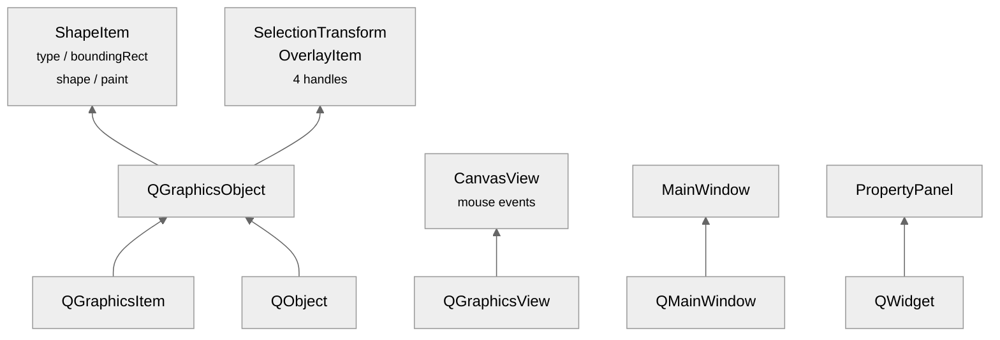
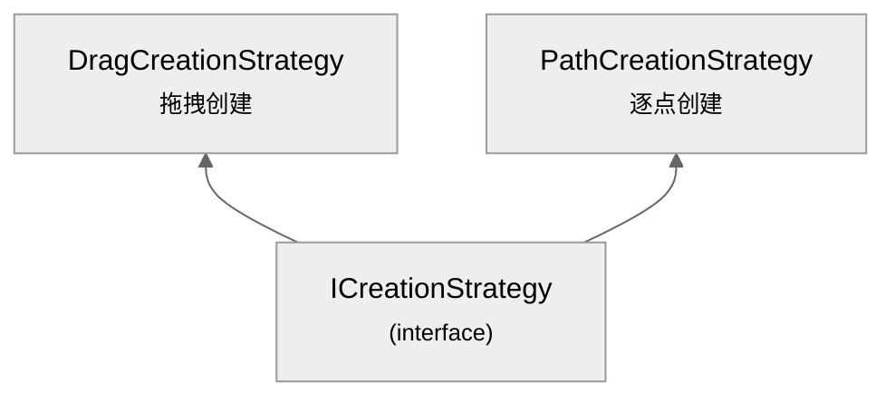

# 继承层次

Qt 框架类继承 + 自定义多态接口 · 总计 25 个 override

Qt 类层次（灰色框）→ 项目类（白色框）

<v-click>

<strong>override 分布</strong> — ShapeItem: 4 · CanvasView: 6 · DragCreationStrategy: 6 · PathCreationStrategy: 6 · SelectionTransformOverlayItem: 3

</v-click>

<v-click>

<strong>为什么 ShapeItem 继承 QGraphicsObject 而非直接 QGraphicsItem？</strong> — 获得 QObject 的信号/槽机制、元对象系统支持、Qt 父子对象生命周期管理

</v-click>

<!--
项目的类层次分为两大部分：Qt框架类继承链和自定义多态接口。ShapeItem继承QGraphicsObject而非直接QGraphicsItem，是为了获得信号槽支持和QObject的元对象系统。CanvasView继承QGraphicsView并重写鼠标事件函数，体现模板方法模式——父类定义框架，子类定制行为。ICreationStrategy是纯虚接口，6个纯虚函数没有合理的默认实现。25个override关键字保证虚函数签名的编译时校验。
-->
