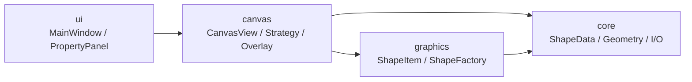

# 四层架构

  项目按 <code>ui → canvas → graphics → core</code> 四层组织。依赖方向单向、职责边界固定，核心逻辑能脱离窗口类独立复用和测试。

  
上层组织界面与输入，下层负责图形表达、数据约束和持久化契约。

  

    
Rule 01

    
<code>core</code> 不依赖 Qt Widgets：<code>ShapeData</code>、<code>FileManager</code>、<code>CanvasGeometry</code> 可在无 <code>QApplication</code> 的测试进程里跑。

  

  

    
Rule 02

    
输入分发在 <code>canvas</code>，绘制在 <code>graphics</code>，数据与几何在 <code>core</code>，每层只回答自己的问题。

  

  

    
Rule 03

    
<code>core</code> 被打包成 <code>vector_graphics_editor_core</code> 静态库，被 app 和测试共同链接。

  

<!--
各位老师，这一页讲组织代码的硬规则。四层是 ui、canvas、graphics、core，依赖方向只能从上往下。core 不引 Qt Widgets，只用 Qt Core。core 被打包成静态库，app 和 tests 一起链接，从物理上保证分层不被破坏。
-->
