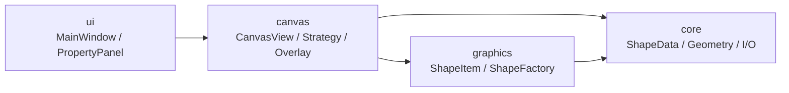

# 四层架构

  项目按 <code>ui → canvas → graphics → core</code> 四层组织。依赖方向单向、职责边界固定，核心逻辑能脱离窗口类独立复用和测试。

  
上层负责组织界面与输入，下层负责图形表达、数据约束和持久化契约。

  

    
Rule 01

    
<code>core</code> 层不依赖 Qt Widgets：<code>ShapeData</code>、<code>FileManager</code>、<code>CanvasGeometry</code> 可以在没有 <code>QApplication</code> 的测试进程里跑。

  

  

    
Rule 02

    
输入分发在 <code>canvas</code>，绘制在 <code>graphics</code>，数据与几何在 <code>core</code>，每层只回答自己的问题。

  

  

    
Rule 03

    
<code>core</code> 被打包成 <code>vector_graphics_editor_core</code> 静态库，被 app 和测试共同链接，物理上保证边界。

  

<!--
各位老师，这一页我先讲组织代码的硬规则。四层是 ui、canvas、graphics、core，依赖方向只能从上往下，core 不反向依赖上层。具体落地点：core 不引 Qt Widgets，只用 Qt Core——这意味着 ShapeData、FileManager、CanvasGeometry 这三个类可以在没有 QApplication 的测试进程里跑起来。这条规则带来一个直接好处：后面测试页会看到，ShapeDataTests、FileManagerTests、CanvasGeometryTests 都不需要启动主窗口。core 被打包成 vector_graphics_editor_core 静态库，app 和 tests 一起链接，从物理上保证了分层不会被破坏。Rule 02 是各层的职责分配：输入分发在 canvas，绘制在 graphics，数据与几何在 core。下面进入核心数据模型 ShapeData。
-->
