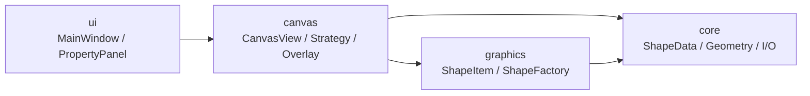

# 四层架构

  项目按 <code>ui → canvas → graphics → core</code> 四层组织。
  真正关键的不是名字，而是依赖方向固定、职责边界清楚，因此核心逻辑可以脱离窗口类独立复用和测试。

  
上层负责组织界面与输入，下层负责图形表达、数据约束和持久化契约。

  

    
Rule 01

    
<code>core</code> 层不依赖 Qt Widgets，因此文件格式、几何约束和测试都不需要借助主窗口才能运行。

  

  

    
Rule 02

    
输入分发留在 <code>canvas</code>，绘制留在 <code>graphics</code>，数据与几何留在 <code>core</code>，每层都只回答自己的问题。

  

<!--
架构页要强调：这不是“为了分层而分层”，而是为了让 ShapeData、FileManager、CanvasGeometry 这些核心逻辑能脱离界面独立验证。如果把它们都塞进 MainWindow，后面的测试和扩展都会变得很痛苦。
-->
