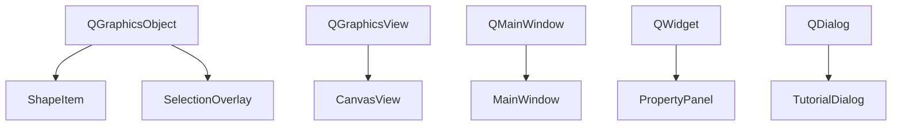
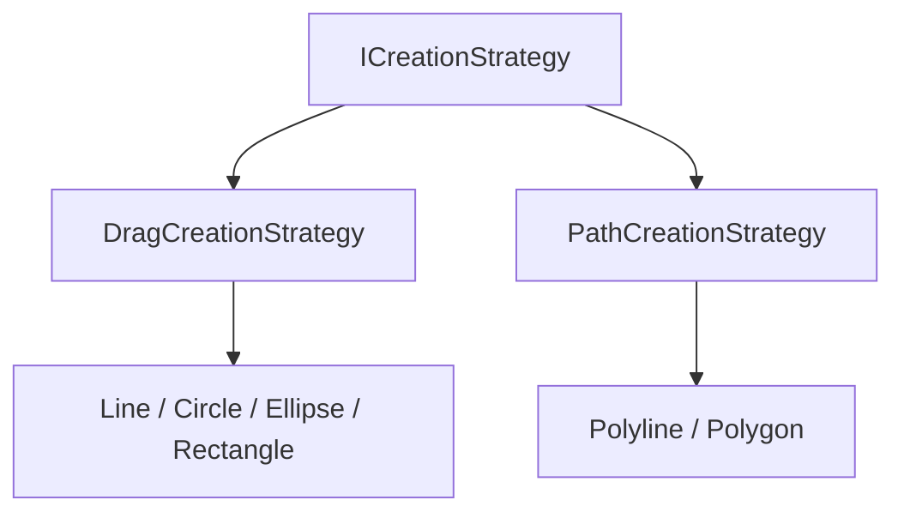

# 继承体系

  项目里的继承关系分成两类：一类承接 Qt 已有的窗口与图形框架，一类把创建流程抽象成可切换的运行时策略。

::left::

Qt 继承链回答“每个界面对象应该挂在哪个成熟宿主类型上”。

::right::

业务继承链回答“同样的鼠标输入为何能切换成不同图形创建行为”。

  真正重要的不是“画出多少继承箭头”，而是让 Qt 框架复用和业务多态扩展各自站在合适的位置上。

<!--
这页适合回答“你的项目里有哪些继承关系”。先讲左边：为什么 ShapeItem 继承 QGraphicsObject，而不是更底层的 QGraphicsItem。再讲右边：为什么把创建行为抽象成 ICreationStrategy，用运行时多态切换 Line / Rectangle / Polygon 等工具。
-->
