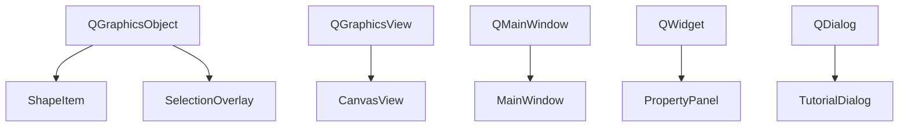
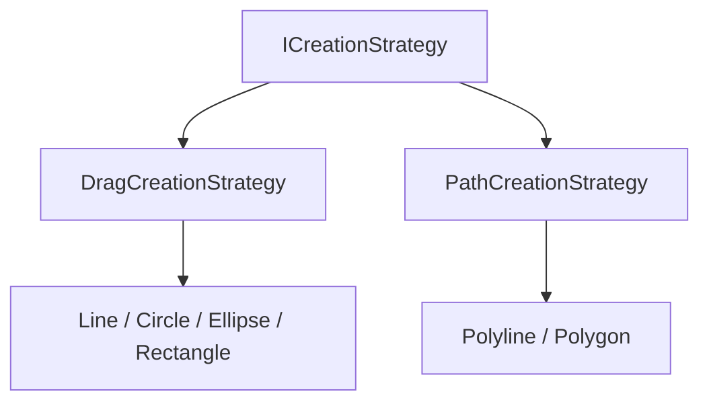

# 继承体系

  项目里的继承分两类：一类承接 Qt 已有的窗口与图形框架，一类把创建流程抽象成运行时可切换的策略。

::left::

Qt 继承链：界面对象挂在最合适的宿主类型上。

::right::

业务继承链：同一组鼠标事件切换成不同的创建行为。

  左链复用 Qt 信号槽和事件分发；右链让 <code>CanvasView</code> 不为每种图形写 if / else。

<!--
各位老师，左边是 Qt 框架继承：ShapeItem 继承 QGraphicsObject 而非 QGraphicsItem，因为需要信号槽。右边是业务继承：ICreationStrategy 抽象出 begin / update / finish / cancel / inProgress 五个虚函数，工具切换发生在运行时。
-->
