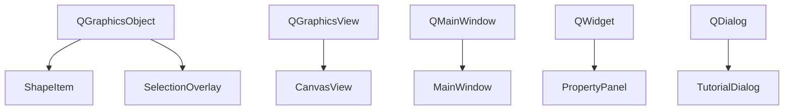
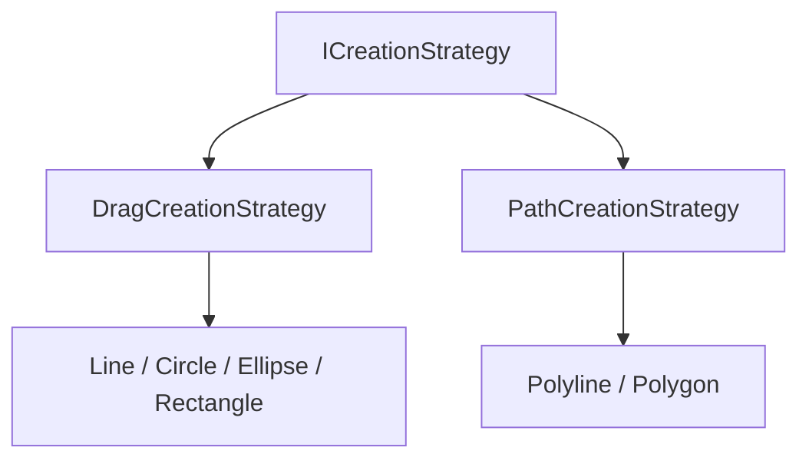

# 继承体系

  项目里的继承分两类：一类承接 Qt 已有的窗口与图形框架，一类把创建流程抽象成运行时可切换的策略。

::left::

Qt 继承链：每个界面对象挂在最合适的成熟宿主类型上。

::right::

业务继承链：同一组鼠标事件能切换成不同的图形创建行为。

  左链复用 Qt 信号槽和事件分发；右链让 <code>CanvasView</code> 不为每种图形写一份 if / else。

<!--
各位老师，这一页我讲项目里两组不同的继承关系。左边是 Qt 框架继承：ShapeItem 继承 QGraphicsObject 而不是更底层的 QGraphicsItem，是因为我需要用 Qt 的信号槽机制把 shapeChanged 这种事件从图形层推回画布层。CanvasView 继承 QGraphicsView 来拿到坐标变换和鼠标事件分发的内置能力。右边是业务继承：ICreationStrategy 抽象出 begin / update / finish / cancel / inProgress 五个虚函数，DragCreationStrategy 和 PathCreationStrategy 各自实现，工具切换就发生在运行时——这个下一页会展开讲 CreationContext 的依赖注入。两组继承解决的问题不同，左边利用 Qt 已有的能力，右边解决业务逻辑的多态扩展。
-->
