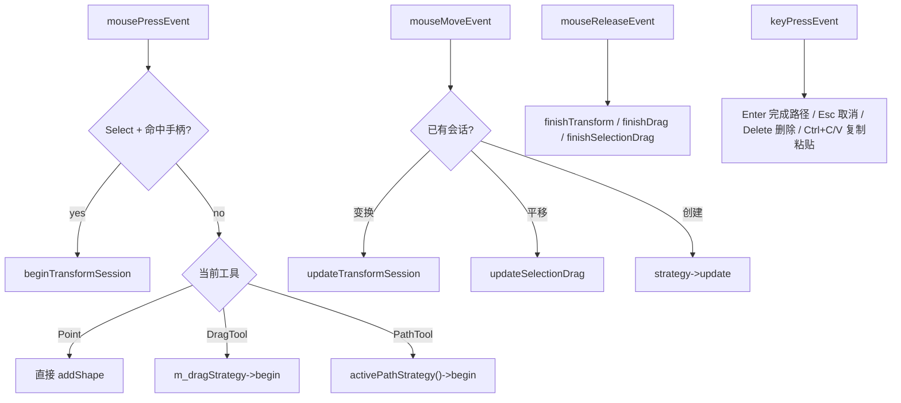

# 事件分发流程

  事件页的核心问题不是“有哪些回调函数”，而是“同一时刻哪个会话拥有控制权”。
  输入一旦进入某个会话，后续事件就不会再误流向别的路径。

  
事件从鼠标与键盘入口进入，但真正的几何计算和图形创建在更下游的组件中完成。

  

    

      
ROUTE

      
先分发，再计算

      
<code>CanvasViewInput.cpp</code> 负责识别当前模式并决定事件流向，几何计算被下放到策略和 <code>CanvasGeometry</code>。

    

    

      
PRIORITY

      
手柄优先级高于普通选中

      
这样用户拖缩放柄时不会误触发 item selection，缩放与平移的意图边界更清楚。

    

  

  

    <v-switch>
      <template #1>
        
鼠标按下时先判断“是不是在缩放”，再决定是否进入创建或拖拽。

      </template>
      <template #2>
        
鼠标移动时只服务当前活动会话，避免状态交叉污染。

      </template>
      <template #3>
        
键盘事件负责结束、取消和编辑命令，补全整套交互闭环。

      </template>
    </v-switch>
  

<!--
这一页讲“输入状态机”。最重要的点是：不同会话互斥，事件只会流向一个明确入口。比如变换会话开始后，mouseMove 不再进入普通拖拽创建逻辑，这样状态才稳定。
-->
