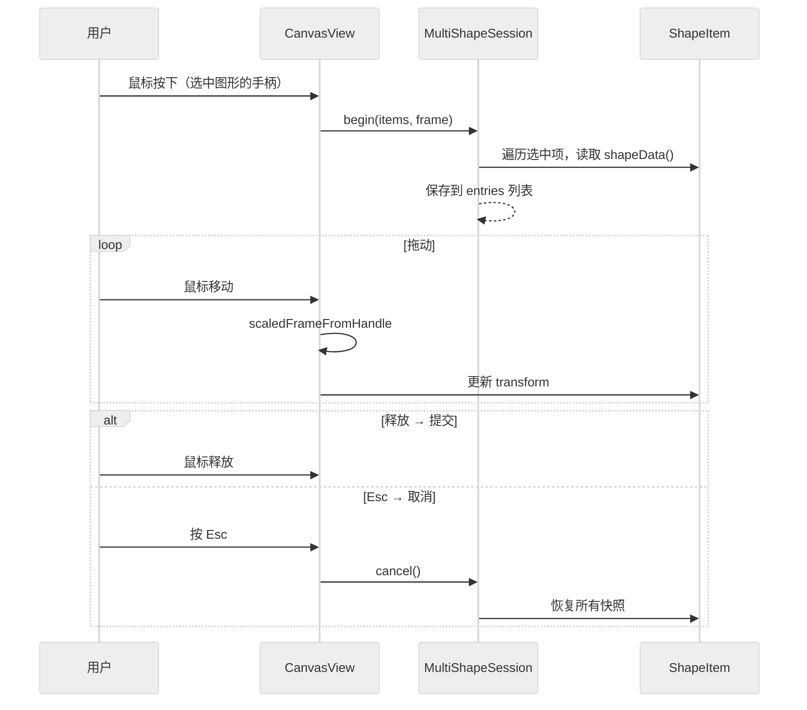

# 选中与变换

MultiShapeSession 快照 · 按 Esc 撤销当前变换

<v-click>

<strong>SelectionFrame</strong> — topLeft + xAxis + yAxis 表示任意朝向矩形

<strong>CanvasGeometry</strong> — 4 个缩放变换函数，Shift 保持比例

</v-click>

<!--
选中图形的变换操作通过MultiShapeSession实现快照机制，是简化版的备忘录模式。变换开始前保存所有选中图形的ShapeData快照，变换过程中实时更新transform。Esc取消时恢复所有快照数据。SelectionFrame用三个QPointF表示任意朝向矩形，可以处理旋转后的选中框。CanvasGeometry的scaledFrameFromHandle计算缩放变换矩阵，做了最小缩放限制0.01和Shift键保持比例的支持。
-->
